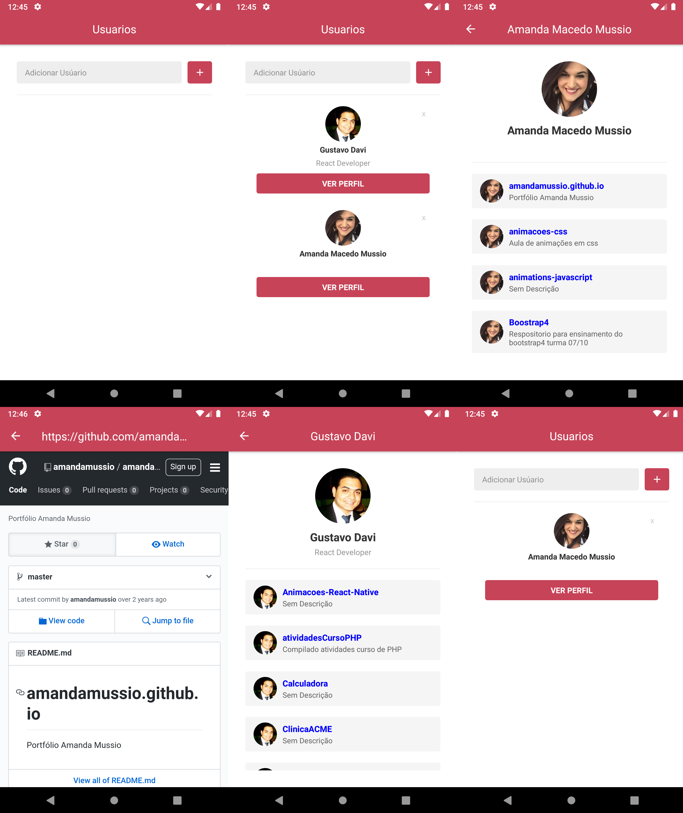

# Teste tecnico Fliper - by Gustavo Davi

## Passo a passo para a instalação

Clone este repositório através da linha de comando

git clone https://github.com/GugaDavi/testeFliper - **Necessario git estar instalado**

Ou faça o download e extraia os arquivos.

Através do terminal acesse a pasta raiz do projeto e rode:

`yarn` ou `npm install`

Inicie um emulador ou conecte um aparelho via usb e digite os seguintes comandos seguido de enter:

`react-native run-android` - Emulador ou celular Android
`react-native run-ios` - Emulador ou celular IOS

Agora é só acessar o aplicativo e visualizar todas suas funcionalidades através das credenciais:

Projeto construindo com React Native para consumir a API do Github, mais especificamente os repositórios favoritos de cada usuário.

## Usabilidade

### Main

Na aplicação podemos salvar varios usuarios e exlui-los também.

### User

Acessando essa tela será possivel ver: Avatar do usuario, descrição e seus repositorios. Precionando o nome do repositorio você será direcionada para a pagina do repositorio ainda dentro da aplicação.

### WebView

Acessa a pagina do repositorio no Github dentro da aplicação.

## ScrenShots

